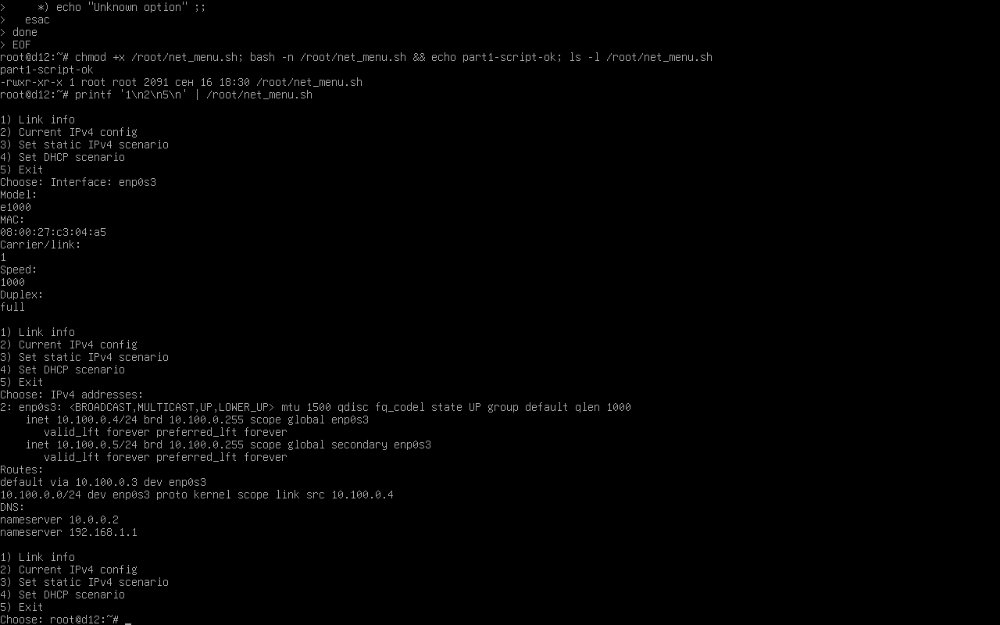
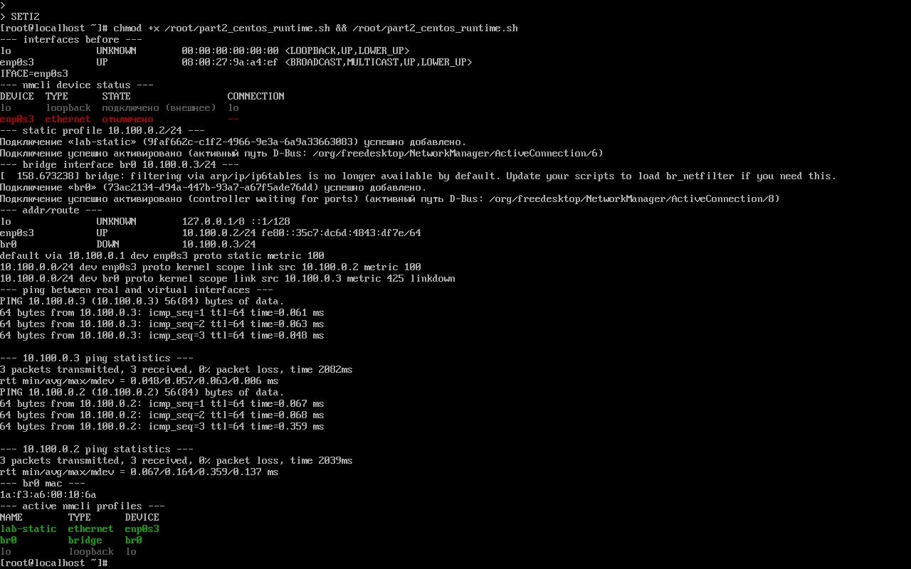
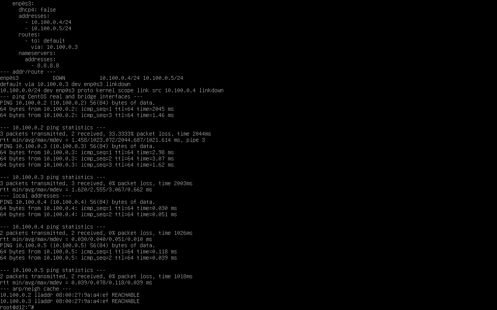
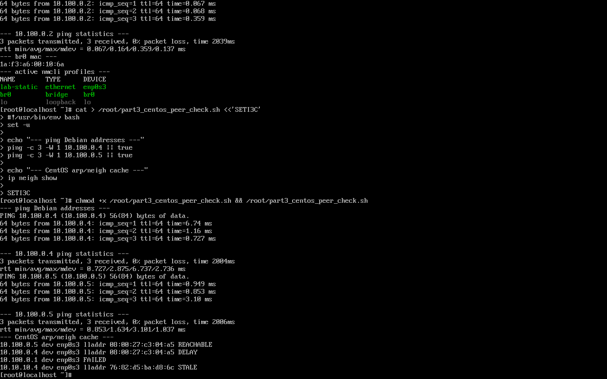
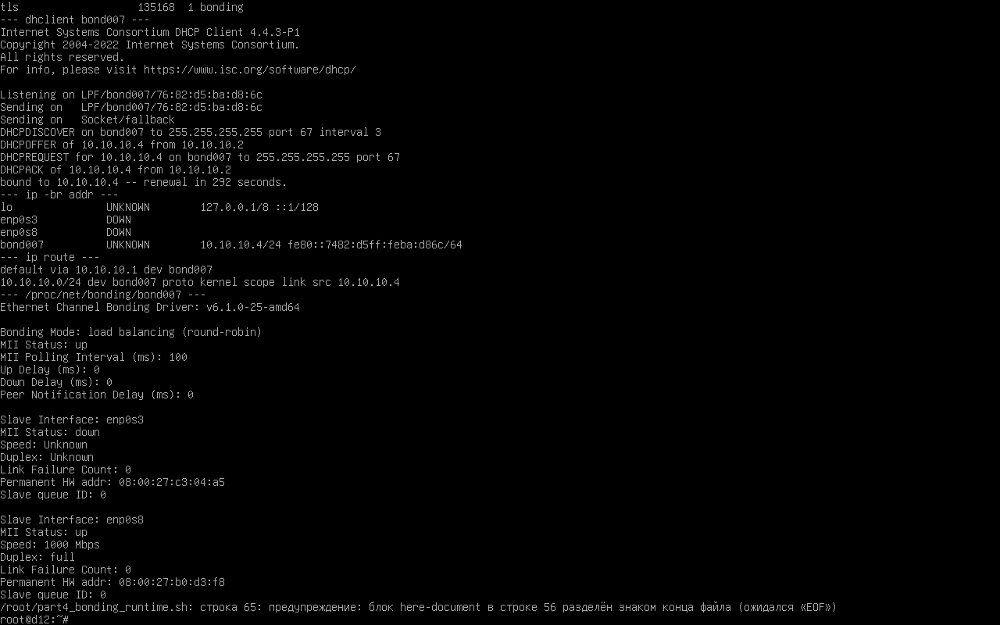
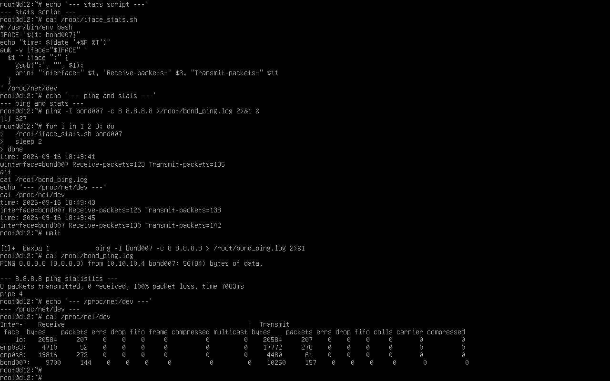

# Практическая работа №1

## Утилиты настройки сетевых подключений в Linux

**Отчет по выполнению лабораторной работы**  
**Выполнил:** ____________________  
**Группа:** ____________________  
**Год:** 2026

---

## 1. Цель работы

Получить практические навыки настройки сетевых интерфейсов Linux средствами `ip`, `nmcli` и `netplan`, настроить bonding-интерфейс и проанализировать счетчики сетевого трафика.

## 2. Исходные данные

В VirtualBox были импортированы две виртуальные машины из OVA:

| Виртуальная машина | Операционная система | Сетевой адаптер | MAC-адрес |
|---|---|---|---|
| `Centos9` | CentOS Stream 9 | Intel PRO/1000 MT Desktop | `08:00:27:9a:a4:ef` |
| `Debian 12` | Debian 12 | Intel PRO/1000 MT Desktop | `08:00:27:c3:04:a5` |

В тексте задания указаны CentOS 7 и Debian 11, однако предоставленные OVA фактически содержали CentOS Stream 9 и Debian 12. Используемые утилиты и порядок настройки соответствуют заданию.

## 3. Часть 1. Скрипт настройки интерфейса

На Debian создан скрипт `part1_net_menu.sh`. Он не изменяет постоянные конфигурационные файлы и использует runtime-команды `ip`, `resolvectl` и `dhclient`.

Меню скрипта позволяет:

- вывести модель интерфейса, скорость, duplex, состояние link и MAC-адрес;
- вывести текущие IPv4-адреса, маршруты и DNS;
- настроить статический адрес `10.100.0.2/24`, шлюз `10.100.0.1` и DNS `8.8.8.8`;
- получить сетевые настройки по DHCP;
- завершить работу.

### 3.1. Исходный код

```bash
#!/usr/bin/env bash
set -u

IFACE="${1:-$(ip -o link show | awk -F': ' '$2 != "lo" { print $2; exit }')}"
STATIC_IP="10.100.0.2/24"
STATIC_GATE="10.100.0.1"
STATIC_DNS="8.8.8.8"

need_root() {
  if [ "$(id -u)" -ne 0 ]; then
    echo "Run as root."
    exit 1
  fi
}

link_info() {
  echo "Interface: $IFACE"
  echo "Model:"
  basename "$(readlink -f "/sys/class/net/$IFACE/device/driver" 2>/dev/null)" 2>/dev/null || echo "unknown"
  echo "MAC:"
  cat "/sys/class/net/$IFACE/address" 2>/dev/null || echo "unknown"
  echo "Carrier/link:"
  cat "/sys/class/net/$IFACE/carrier" 2>/dev/null || echo "unknown"
  echo "Speed:"
  cat "/sys/class/net/$IFACE/speed" 2>/dev/null || echo "unknown"
  echo "Duplex:"
  cat "/sys/class/net/$IFACE/duplex" 2>/dev/null || echo "unknown"
  if command -v ethtool >/dev/null 2>&1; then
    ethtool "$IFACE" 2>/dev/null | egrep 'Speed|Duplex|Link detected'
  fi
}

ipv4_info() {
  echo "IPv4 addresses:"
  ip -4 addr show dev "$IFACE"
  echo "Routes:"
  ip route
  echo "DNS:"
  cat /etc/resolv.conf
}

set_static() {
  need_root
  ip link set "$IFACE" up
  ip -4 addr flush dev "$IFACE"
  ip addr add "$STATIC_IP" dev "$IFACE"
  ip route replace default via "$STATIC_GATE" dev "$IFACE"
  if command -v resolvectl >/dev/null 2>&1; then
    resolvectl dns "$IFACE" "$STATIC_DNS" || true
  else
    echo "No resolvectl; DNS file was not changed by this script."
  fi
  ipv4_info
}

set_dhcp() {
  need_root
  ip link set "$IFACE" up
  ip -4 addr flush dev "$IFACE"
  if command -v dhclient >/dev/null 2>&1; then
    dhclient -r "$IFACE" 2>/dev/null || true
    dhclient "$IFACE"
  else
    echo "dhclient is not installed."
  fi
  ipv4_info
}

while true; do
  echo
  echo "1) Link info"
  echo "2) Current IPv4 config"
  echo "3) Set static IPv4 scenario"
  echo "4) Set DHCP scenario"
  echo "5) Exit"
  printf "Choose: "
  read -r choice
  case "$choice" in
    1) link_info ;;
    2) ipv4_info ;;
    3) set_static ;;
    4) set_dhcp ;;
    5) exit 0 ;;
    *) echo "Unknown option" ;;
  esac
done
```

Скрипт проверен командой `bash -n`. Для интерфейса `enp0s3` получены следующие данные:

- драйвер: `e1000`;
- MAC-адрес: `08:00:27:c3:04:a5`;
- скорость: `1000 Mbit/s`;
- duplex: `full`.



## 4. Часть 2. Настройка CentOS через nmcli

Сетевой адаптер CentOS переведен в режим `Internal Network`. Имя внутренней сети: `seti-lab`. Средствами `nmcli` создан статический профиль для физического интерфейса `enp0s3` и bridge-интерфейс `br0`.

### 4.1. Команды настройки

```bash
nmcli con delete lab-static 2>/dev/null || true
nmcli con delete br0 2>/dev/null || true

nmcli con add type ethernet ifname enp0s3 con-name lab-static \
  ipv4.method manual \
  ipv4.addresses 10.100.0.2/24 \
  ipv4.gateway 10.100.0.1 \
  ipv4.dns 8.8.8.8 \
  autoconnect yes
nmcli con up lab-static

nmcli con add type bridge ifname br0 con-name br0 \
  ipv4.method manual \
  ipv4.addresses 10.100.0.3/24 \
  autoconnect yes
nmcli con up br0

ip -br addr
ip route
ping -c 3 10.100.0.3
ping -c 3 10.100.0.2
cat /sys/class/net/br0/address
```

### 4.2. Результат

- `enp0s3` получил адрес `10.100.0.2/24`;
- `br0` получил адрес `10.100.0.3/24`;
- ping адресов `10.100.0.2` и `10.100.0.3` прошел без потерь;
- MAC-адрес `br0`: `1a:f3:a6:00:10:6a`.



## 5. Часть 3. Debian, netplan и проверка связи

В Debian установлен пакет `netplan.io`. Для интерфейса `enp0s3` подготовлен файл `/etc/netplan/99-lab.yaml` со статическими адресами `10.100.0.4/24` и `10.100.0.5/24`, маршрутом по умолчанию через `10.100.0.3` и DNS-сервером `8.8.8.8`.

### 5.1. Конфигурация netplan

```yaml
network:
  version: 2
  renderer: networkd
  ethernets:
    enp0s3:
      dhcp4: false
      addresses:
        - 10.100.0.4/24
        - 10.100.0.5/24
      routes:
        - to: default
          via: 10.100.0.3
      nameservers:
        addresses:
          - 8.8.8.8
```

На предоставленном образе команда `netplan apply` сообщила об отсутствии службы `systemd-networkd`. Поэтому для проверки адреса дополнительно назначены runtime-командами `ip`. YAML-файл сохранен как требуемая постоянная конфигурация.

```bash
ip addr flush dev enp0s3
ip link set enp0s3 up
ip addr add 10.100.0.4/24 dev enp0s3
ip addr add 10.100.0.5/24 dev enp0s3
ip route replace default via 10.100.0.3 dev enp0s3

ip -br addr show enp0s3
ip route
ping -c 3 -W 1 10.100.0.2
ping -c 3 -W 1 10.100.0.3
ping -c 2 -W 1 10.100.0.4
ping -c 2 -W 1 10.100.0.5
ip neigh show dev enp0s3
```

### 5.2. Результаты проверки

| Проверка | Результат |
|---|---|
| Debian -> `10.100.0.2` | 2 ответа из 3 |
| Debian -> `10.100.0.3` | 3 ответа из 3 |
| Debian -> локальный `10.100.0.4` | без потерь |
| Debian -> локальный `10.100.0.5` | без потерь |
| CentOS -> `10.100.0.4` | 3 ответа из 3 |
| CentOS -> `10.100.0.5` | 3 ответа из 3 |

ARP/neighbor cache Debian содержит удаленные записи `10.100.0.2` и `10.100.0.3`. На CentOS получены записи для `10.100.0.4` и `10.100.0.5`. Адреса `10.100.0.4` и `10.100.0.5` локальны для Debian, поэтому они не отображаются в ARP-кэше самой Debian как соседние устройства.





## 6. Часть 4. Bonding

Для Debian добавлен второй сетевой адаптер. Оба адаптера временно переведены в режим `NAT Network`, имя сети - `lab-nat`, DHCP включен. Внутри Debian загружен модуль `bonding` и создан интерфейс `bond007` в режиме `balance-rr`.

### 6.1. Основные команды

```bash
modprobe bonding

ip link set enp0s3 down
ip link set enp0s8 down
ip link add bond007 type bond mode balance-rr miimon 100
ip link set enp0s3 master bond007
ip link set enp0s8 master bond007
ip link set enp0s3 up
ip link set enp0s8 up
ip link set bond007 up

dhclient -1 -v bond007
ip -br addr
ip route
cat /proc/net/bonding/bond007
```

### 6.2. Результат настройки

- создан интерфейс `bond007`;
- режим bonding: `load balancing (round-robin)`;
- DHCP выдал адрес `10.10.10.4/24`;
- маршрут по умолчанию установлен через `10.10.10.1`;
- slave-интерфейсы: `enp0s3` и `enp0s8`;
- MAC `enp0s3`: `08:00:27:c3:04:a5`;
- MAC `enp0s8`: `08:00:27:b0:d3:f8`.



### 6.3. Скрипт статистики

```bash
#!/usr/bin/env bash
set -u

IFACE="${1:-bond007}"
echo "time: $(date '+%F %T')"
awk -v iface="$IFACE" '
  $1 ~ iface ":" {
    gsub(":", "", $1);
    print "interface=" $1, "Receive-packets=" $3, "Transmit-packets=" $11
  }
' /proc/net/dev
```

Во время выполнения `ping -I bond007 -c 8 8.8.8.8` скрипт статистики запущен три раза:

| Время | RX packets | TX packets |
|---|---:|---:|
| `18:49:41` | 123 | 135 |
| `18:49:43` | 126 | 138 |
| `18:49:45` | 130 | 142 |

Пакеты к `8.8.8.8` через VirtualBox NAT Network получили 100% потерь, однако увеличение TX/RX-счетчиков показывает, что трафик через `bond007` формировался и обрабатывался интерфейсом. В `/proc/net/dev` также видно распределение статистики между `enp0s3`, `enp0s8` и `bond007`.



## 7. Ответы на контрольные вопросы

### 7.1. Основные команды ip

| Действие | Команда |
|---|---|
| Назначить IPv4-адрес | `ip addr add 10.100.0.2/24 dev enp0s3` |
| Изменить MAC-адрес | `ip link set dev enp0s3 address 02:11:22:33:44:55` |
| Назначить gateway | `ip route replace default via 10.100.0.1 dev enp0s3` |
| Показать ARP-кэш | `ip neigh` |
| Очистить ARP-кэш | `ip neigh flush all` |
| Включить интерфейс | `ip link set enp0s3 up` |
| Выключить интерфейс | `ip link set enp0s3 down` |

### 7.2. Что такое duplex

Half duplex означает, что устройство в один момент времени либо передает, либо принимает данные. Full duplex позволяет одновременно передавать и принимать данные. Auto negotiation используется для автоматического согласования скорости и режима duplex между устройствами.

### 7.3. Зачем одному интерфейсу несколько IP-адресов

Несколько IP-адресов применяются для размещения нескольких сервисов, виртуального хостинга, миграции адресов, отказоустойчивости, работы с несколькими подсетями и временной совместимости при перенумерации сети.

### 7.4. Для чего нужны виртуальные интерфейсы

Виртуальные интерфейсы используются для bridge, VLAN, контейнеров, маршрутизации, лабораторных стендов, изоляции трафика и проверки сетевых сценариев без добавления физических сетевых карт.

### 7.5. Режимы bonding

| Режим | Назначение |
|---|---|
| `balance-rr`, mode 0 | Поочередная передача пакетов через slave-интерфейсы |
| `active-backup`, mode 1 | Один активный и один резервный интерфейс |
| `balance-xor`, mode 2 | Выбор интерфейса по хешу |
| `broadcast`, mode 3 | Отправка пакетов через все slave-интерфейсы |
| `802.3ad`, mode 4 | LACP-агрегация; требуется поддержка коммутатора |
| `balance-tlb`, mode 5 | Адаптивная балансировка исходящего трафика |
| `balance-alb`, mode 6 | Адаптивная балансировка исходящего и входящего трафика |

## 8. Вывод

В ходе работы сетевые интерфейсы Linux были настроены несколькими способами: runtime-командами `ip`, через `nmcli` на CentOS, с помощью конфигурации `netplan` на Debian и посредством bonding-интерфейса `bond007`.

Проверка связи между CentOS и Debian подтвердила работоспособность внутренней сети `seti-lab`. В bonding-сценарии создан интерфейс в режиме round-robin, получен DHCP-адрес и проанализированы счетчики трафика из `/proc/net/dev`.

## 9. Приложения

Исходные файлы находятся в одной папке с отчетом:

- [`part1_net_menu.sh`](part1_net_menu.sh);
- [`part2_centos_runtime.sh`](part2_centos_runtime.sh);
- [`part3_debian_netplan_99-lab.yaml`](part3_debian_netplan_99-lab.yaml);
- [`part3_debian_runtime_check.sh`](part3_debian_runtime_check.sh);
- [`part4_bonding_runtime.sh`](part4_bonding_runtime.sh);
- [`part4_iface_stats.sh`](part4_iface_stats.sh).
